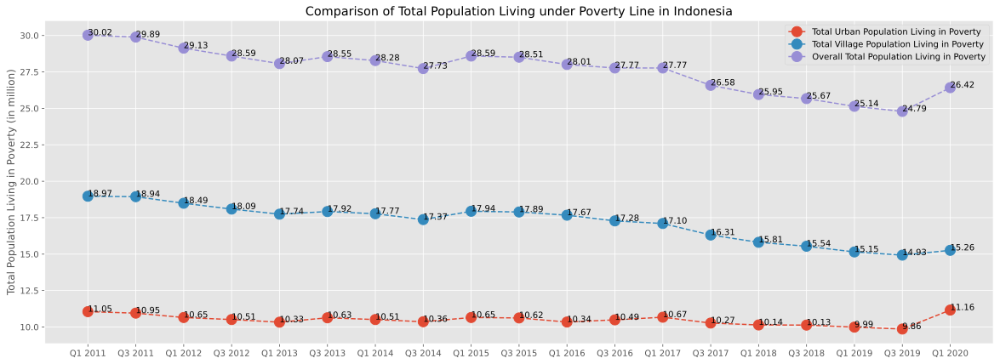
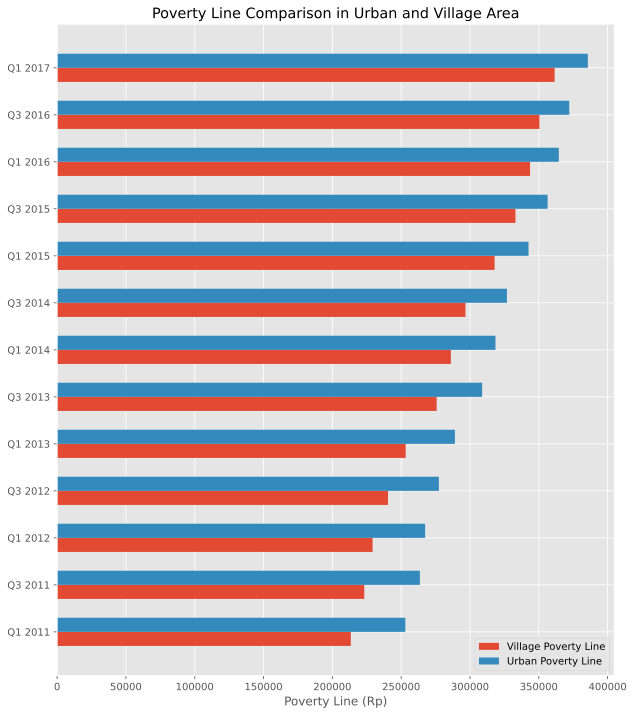
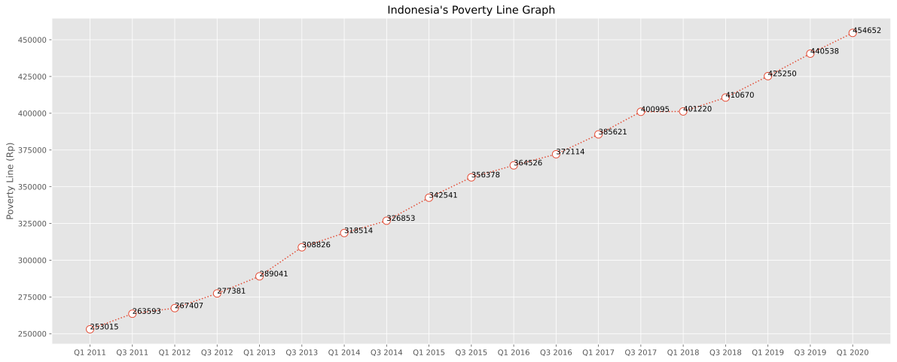

```python
#import libraries
import pandas as pd
import numpy as np
import matplotlib.pyplot as plt
%matplotlib inline
plt.style.use('ggplot')
pd.set_option('float_format', '{:.2f}'.format)
```


```python
xls = pd.ExcelFile(r'indonesia_poverty.xlsx')
data = xls.parse(0)
```


```python
data = data.dropna()
data.head()
```


<div>
<style scoped>
    .dataframe tbody tr th:only-of-type {
        vertical-align: middle;
    }

    .dataframe tbody tr th {
        vertical-align: top;
    }

    .dataframe thead th {
        text-align: right;
    }
</style>
<table border="1" class="dataframe">
  <thead>
    <tr style="text-align: right;">
      <th></th>
      <th>Tahun</th>
      <th>Jumlah Penduduk Miskin (Kota)</th>
      <th>Jumlah Penduduk Miskin (Desa)</th>
      <th>Jumlah Penduduk Miskin (Total)</th>
      <th>Persentase Kemiskinan (Kota)</th>
      <th>Persentase Kemiskinan (Desa)</th>
      <th>Persentase Kemiskinan (Total)</th>
      <th>Garis Kemiskinan Kota</th>
      <th>Garis Kemiskinan Desa</th>
    </tr>
  </thead>
  <tbody>
    <tr>
      <th>0</th>
      <td>1976</td>
      <td>10.00</td>
      <td>44.20</td>
      <td>54.20</td>
      <td>38.80</td>
      <td>40.40</td>
      <td>40.10</td>
      <td>4522.00</td>
      <td>2849</td>
    </tr>
    <tr>
      <th>1</th>
      <td>1977</td>
      <td>8.30</td>
      <td>38.90</td>
      <td>47.20</td>
      <td>30.80</td>
      <td>33.40</td>
      <td>33.30</td>
      <td>4969.00</td>
      <td>2981</td>
    </tr>
    <tr>
      <th>2</th>
      <td>1978</td>
      <td>9.50</td>
      <td>32.80</td>
      <td>42.30</td>
      <td>29.00</td>
      <td>28.40</td>
      <td>28.60</td>
      <td>6831.00</td>
      <td>4449</td>
    </tr>
    <tr>
      <th>3</th>
      <td>1979</td>
      <td>9.30</td>
      <td>31.30</td>
      <td>40.60</td>
      <td>28.10</td>
      <td>26.50</td>
      <td>26.90</td>
      <td>9777.00</td>
      <td>5877</td>
    </tr>
    <tr>
      <th>4</th>
      <td>1980</td>
      <td>9.30</td>
      <td>25.70</td>
      <td>35.00</td>
      <td>23.10</td>
      <td>21.20</td>
      <td>21.60</td>
      <td>13731.00</td>
      <td>7746</td>
    </tr>
  </tbody>
</table>
</div>


```python
def text_value(x, y):
    for i,j in zip(x, y):
        plt.annotate(str("{:.2f}".format(j)), (i,j))

fig, ax = plt.subplots(figsize=(20,7))
x_axis = data['Tahun'].iloc[-19:]
y1, y2, y3 = data['Jumlah Penduduk Miskin (Kota)'].iloc[-19:], data['Jumlah Penduduk Miskin (Desa)'].iloc[-19:], data['Jumlah Penduduk Miskin (Total)'].iloc[-19:]

plt.plot(x_axis, y1, linestyle='dashed', marker='o', markersize=12)
text_value(x_axis, y1)
plt.plot(x_axis, y2, linestyle='dashed', marker='o', markersize=12)
text_value(x_axis, y2)
plt.plot(x_axis, y3, linestyle='dashed', marker='o', markersize=12)
text_value(x_axis, y3)

ax.set_ylabel('Total Population Living in Poverty (in million)')
plt.title('Comparison of Total Population Living under Poverty Line in Indonesia')
plt.legend(['Total Urban Population Living in Poverty', 'Total Village Population Living in Poverty', 'Overall Total Population Living in Poverty'])

```


    <matplotlib.legend.Legend at 0x11962b850>





```python
fig, ax = plt.subplots(figsize=(20,7))
x_axis = np.arange(19)
y1, y2, y3 = data['Persentase Kemiskinan (Kota)'].iloc[-19:], data['Persentase Kemiskinan (Desa)'].iloc[-19:], data['Persentase Kemiskinan (Total)'].iloc[-19:]
plt.bar(x_axis, y1, width=0.2, align='center')
plt.bar(x_axis+0.2, y2, width=0.2, align='center')
plt.bar(x_axis+2*0.2, y3, width=0.2, align='center')

ax.set_xticks(x_axis+0.2)
ax.set_xticklabels( [i for i in data['Tahun'].iloc[-19:]] )
ax.set_ylabel('Poverty Percentage (%)')
plt.title('Poverty Percentage Comparison in Indonesia')
plt.legend(['Urban Poverty Percentage', 'Village Poverty Percentage', 'Overall Poverty Percentage'])
```


    <matplotlib.legend.Legend at 0x119acd280>


```python
fig, ax = plt.subplots(figsize=(10,12))
x_axis = np.arange(36-23)
y1, y2 = data['Garis Kemiskinan Desa'].iloc[23:36], data['Garis Kemiskinan Kota'].iloc[23:36]
plt.barh(x_axis, y1, height=0.3, align='center')
plt.barh(x_axis+0.3, y2, height=0.3, align='center')
ax.set_yticks(x_axis+0.15)
ax.set_yticklabels( [i for i in data['Tahun'].iloc[23:36]] )
ax.set_xlabel('Poverty Line (Rp)')
plt.title('Poverty Line Comparison in Urban and Village Area')
plt.legend(['Village Poverty Line', 'Urban Poverty Line'])
```


    <matplotlib.legend.Legend at 0x119aa21f0>





```python
fig = plt.figure(figsize=(20,8))
y = data['Garis Kemiskinan Kota'].iloc[-19:]
x = data['Tahun'].iloc[-19:]
for i,j in zip(x, y):
    plt.annotate(int(j), (i,j))
plt.ylabel('Poverty Line (Rp)')
plt.title('Indonesia\'s Poverty Line Graph')
plt.plot(x,y,marker='o', markersize=10, markerfacecolor='white', linestyle=':')
```


    [<matplotlib.lines.Line2D at 0x119f586d0>]





```python

```
